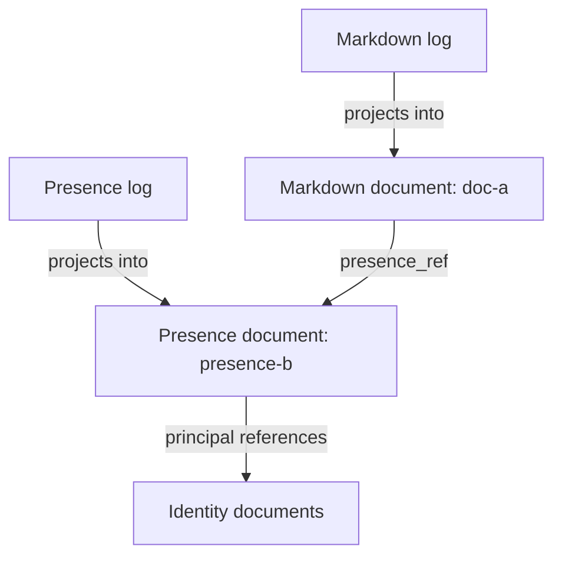

# Commonplace presence: participants in ordinary documents

Date: 2026-09-06  
Status: Proposal  
Scope: Presence, its relationship to identity and delegation, and its representation using Commonplace documents, logs, directories, Cells, verbs, and subscriptions.

This records the design developed in this conversation. Schema names and operation names below are proposed contracts, not claims about APIs already implemented in the repositories.

## 1. Decision

Represent presence in an ordinary Commonplace document whose structured content is a map of participation records. Give that document its own log. Associate it with the document people are gathered around, and expose it through an ordinary directory entry:

```text
/.commonplace/presence/<subject-document-uuid>
```

The subject document carries an authoritative `presence_ref` pointing to the presence document. The directory provides an inspectable organization of those associations. Its entry name is the subject's UUID; its entry value references the separate presence document's UUID.

A presence document is an application profile and schema built from existing primitives. It requires no new core storage primitive and no new kind of Cell. Host-side verbs maintain its records; ordinary subscriptions expose changes.

Presence updates append to the presence document's log. They do not append to the subject's content history. The subject's metadata changes when the association is provisioned or deliberately changed, not on every arrival, heartbeat, or cursor movement.

## 2. Motivation: make agency visible

The intended experience combines several familiar ideas:

| Inspiration | Contribution to Commonplace |
| --- | --- |
| MUD rooms | Enter a shared context and discover its inhabitants and activity. |
| Instant Messenger status | Communicate availability or intention without addressing someone directly. |
| The file-system VR scene in *Disclosure* | Make operations such as opening and deleting files observable. |
| Google Sheets cursors | Show another participant's position within a shared object. |
| Coding subagents | Distinguish concurrent workers and the relationships between them. |
| An executive assistant acting for a CEO | Preserve the difference between the actor and the principal they represent. |

Commonplace should make it possible to enter ongoing work, discover who is participating, understand what they are doing and for whom, and address them. A presence roster is the first part of that experience. Watching operations and coordinating work build on the same identity and authority relationships.

## 3. Identity, activation, participation, and focus

Keep the following concepts distinct:

| Concept | Meaning | Example |
| --- | --- | --- |
| Principal | A durable, addressable identity | Jes; a particular agent; an organization |
| Activation | A live operating instance associated with an identity | An authenticated browser session; an agent execution |
| Presence scope | The shared context in which participants encounter one another | A Markdown document; a directory; a task document |
| Participation | One activation's particular involvement in a scope | One browser tab viewing a document |
| Focus | Position or object of interaction within that participation | A text selection; a spreadsheet cell; a task step |
| Grant | Explicit authority to perform particular operations | Permission for an agent to edit specified documents |

A person can have multiple activations. An activation can have multiple participations. Two tabs showing the same document have distinct participation IDs even when they share an authenticated session. The UI may group those records by principal, while preserving distinct selections and activities.

An agent's durable identity can survive execution restarts or model changes. Creating a child identity does not grant it permissions. Its creation relationship, delegated authority, and representation of another principal remain separate facts.

The existing Session Cell and durable Editor Cell also remain distinct. A participation record does not turn a browser tab into a Cell, or make a durable Editor Cell count as a person who is currently present.

## 4. The unit of presence

The default scope is the stable identity of the shared subject document. A document is the meeting place; a cursor or selection is focus within that place.

| Subject document | Focus within its presence scope |
| --- | --- |
| Markdown document | Section, selection, or edit anchor |
| Spreadsheet document | Sheet and cell range |
| Directory document | Selected child or navigation target |
| Task document | Current step, inspected resource, or waiting condition |
| Project or room document | Relevant task or document |

A separate scope is useful when there should be an independent answer to “who is here?” A paragraph normally needs focus information. A dedicated review session concerning that paragraph could have its own document and scope if it needs a distinct group or lifecycle.

Participation can overlap. Someone can explicitly join a release room while editing a document, and identify that document as their focus in the release room. Directory containment does not automatically broadcast a participant into all ancestors. A background subscription or replica does not automatically join a room.

For the beta, one subject document has one associated presence document. Multiple audiences or independent rooms around the same subject are a later extension; they should not be simulated by exposing a single roster with inconsistent visibility rules.

## 5. Storage in existing primitives

For a Markdown document `doc-a` and its presence document `presence-b`:



| Existing primitive | Responsibility |
| --- | --- |
| Subject document attributes | Store `presence_ref`. |
| Presence document attributes | Identify its profile, schema version, and subject. |
| Presence document structured content | Store a Y.Map keyed by participation ID. |
| Presence document log | Record the changes that produce that content. |
| Directory documents | Expose named paths to subject and presence documents. |
| Document host and verbs | Authenticate commands, validate records, assign leases, and apply changes. |
| Document subscriptions | Deliver an initial state and subsequent changes. |
| Cell | Own and host the documents and their application behavior. |

Participation records are content of the presence document. They are not an unbounded collection of metadata attributes on the Markdown document. This follows the same general distinction as a Directory storing its entries as structured content.

For the beta, the Workspace Documents Cell is the natural host for the canonical subject and its presence document. One host can manage many scopes. There is no requirement for a process or Cell per roster.

The client reaches this behavior through the established authenticated Session/Editor/Workspace relationships. Those relationships require their existing explicit grants; being named in the roster provides none.

## 6. Directory layout and association

Paths below are relative to a workspace root within Commonplace:

| Path | Directory entry target |
| --- | --- |
| `/notes/design.md` | Markdown document `doc-a` |
| `/.commonplace/presence/doc-a` | Presence document `presence-b` |
| `/projects/beta` | Directory document `dir-c` |
| `/.commonplace/presence/dir-c` | Presence document `presence-d` |

`.commonplace` and `presence` are ordinary Directory documents. Their names provide a system namespace. A leading dot is a presentation convention, not an access-control mechanism.

The association is discoverable in two ways:

1. Follow `doc-a`'s `presence_ref` directly to `presence-b`.
2. Resolve the directory entry `/.commonplace/presence/doc-a`.

The reference on the subject is authoritative. A missing or stale directory entry can be repaired from the association; it must not create a competing roster. The presence document also records its subject, allowing the host to validate the relationship.

Treat the association and presence-profile metadata as host-managed operational fields. General content editing must not silently redirect the association. Resolution validates the referenced document's subject, profile, and hosting authority; a matching backlink alone does not establish a trusted relationship.

The UI should expose this as “design.md → Presence,” using the subject's human-readable name. UUID paths remain available for inspection, scripting, and debugging.

### Provisioning

Create the association lazily when needed. Provisioning is an authorized host action; a viewer's request to join does not give the viewer general permission to edit the subject's attributes or system directories.

The subject's authoritative host serializes association creation. Provision a presence document, establish `presence_ref`, and ensure the corresponding directory entry exists. Commonplace need not provide an atomic transaction across all those documents: interrupted provisioning must converge on the committed reference, repair the index, and retire unattached candidates.

Resolve any existing association before creating another. A missing index entry is not evidence that the presence document is absent.

### Paths do not define the room's identity

Renaming or moving `/notes/design.md` preserves its document UUID, presence reference, and participants. Multiple directory entries pointing to the same document lead to the same roster.

A mount in another workspace may index the same authorized association. It does not independently create a second canonical roster. Moving hosting responsibility between Cells requires a separate handoff; a pathname change alone does not transfer ownership or authority.

## 7. Proposed document schema

Identifiers in these examples are readable placeholders for stable references. The attribute names are proposed application schema names and should be reconciled with Commonplace's metadata conventions during implementation.

Subject document attributes:

```json
{
  "presence_ref": "presence-b"
}
```

Presence document attributes:

```json
{
  "profile": "commonplace.presence",
  "schema_version": 1,
  "subject_ref": "doc-a"
}
```

Presence document content, shown as the JSON equivalent of a Y.Map:

```json
{
  "participation-tab-7": {
    "principal_ref": "identity-jes",
    "activation_ref": "activation-browser-42",
    "activity": "viewing",
    "focus": null,
    "view": {
      "document_ref": "editor-mirror-a"
    },
    "lease_until": "2026-09-06T18:01:00Z"
  },
  "participation-agent-3": {
    "principal_ref": "identity-release-agent",
    "activation_ref": "activation-agent-run-9",
    "activity": "waiting_for_review",
    "focus": null,
    "task_ref": "task-release-checklist",
    "on_behalf_of_ref": "identity-jes",
    "delegation_ref": "delegation-release-documents",
    "lease_until": "2026-09-06T18:01:05Z"
  }
}
```

The host supplies or verifies identity, activation, and delegation fields. It assigns `lease_until` using its own clock and lease policy. Clients cannot choose an arbitrarily distant expiry or present themselves as another principal.

Each participation is a separate map entry. For the initial implementation, the host can replace the whole record atomically within a document update, avoiding partial combinations of identity, lease, and focus from different commands.

`focus` is optional and content-profile-specific. Text focus needs a collaborative anchor representation; spreadsheet focus needs sheet and range identifiers. This proposal does not invent a universal cursor-coordinate format. Unsupported or unmappable focus can be omitted while retaining the participant in the roster.

Availability is distinct from local activity. A principal's declared “do not disturb” status can be obtained from its identity/status data and combined with this roster. “Viewing” means that a client reports an open view; it does not prove human attention.

## 8. Verbs and lifecycle

Proposed operations:

| Operation | Behavior |
| --- | --- |
| `join` | Resolve or provision the presence association, admit an authenticated participation, and return its identifier and lease. |
| `update` | Change permitted fields of an existing participation and renew its lease. A renewal may carry no focus change. |
| `leave` | Remove the caller's participation. Repetition is harmless. |
| `watch` | Obtain an authorized initial state and a continuation of changes using the document subscription machinery. |

These are application verbs over ordinary document operations. They are not a proposed second replication protocol.

Opening the Markdown file invokes `join`. The client then reports meaningful activity and focus changes and renews its lease. Navigation or tab closure attempts `leave`. Unexpected disconnection is handled by expiry.

The host binds a participation ID to its admitted activation. It must reject attempts to mutate another participation. Delayed or duplicate commands must not overwrite newer focus or renew a retired participation; request sequencing or existing invocation identities should provide that ordering. A new join after expiry creates a new participation ID. Historical records must never be replayed as fresh client commands.

Use a subscription that establishes a snapshot and continuation without losing changes between them. Watchers also need to update the display when leases expire, even if no subsequent document update arrives.

## 9. Leases, replay, and restart

Stored participation and live presence are different views of the same data. Within an authorized roster, a record is live only while:

```text
record.lease_until > host_now
```

The log reducer does not consult the clock. It deterministically reconstructs the stored map. The host or presentation layer applies the current-time filter to that map. The host may subsequently delete expired entries to bound the current state.

Replaying a lease preserves its original expiry. Restoring yesterday's records cannot turn them into participants today. A short restart can leave a still-unexpired lease visible for the remainder of its original duration; presence is evidence of recent participation, not proof of an uninterrupted connection. It must not be labeled as a verified active socket.

An initial beta policy could use a 45-second lease renewed every 15 seconds, with focus changes renewing opportunistically. These are tuning defaults, not protocol constants. Cleanup must recheck the current lease under the host's serialized update path so it cannot remove a record that was just renewed.

The host's time is authoritative for lease assignment and interpretation. Clients can use a server-time estimate to expire the local display; their clocks do not determine accepted lease duration. Stronger restart invalidation or distributed host handoff would require an explicit host-generation/fencing design rather than inferring liveness from replay.

## 10. Mirrors, versions, and forks

Per-user Editor Cells may hold working mirrors with different local document identities. Those clients resolve the canonical subject's presence association. They do not independently provision a roster for every working mirror.

Use the canonical relationship already established for the mirror to resolve the subject. A matching title or pathname is insufficient evidence that two documents share a room.

Participation may describe its local view, but disclose only identifiers and details appropriate for the roster's audience. Cursor overlays require compatible coordinates or an explicit translation between histories or epochs. When translation is unavailable, show the participant without pretending to know their exact location in the current view.

Do not key a scope by the current Merkle head. Each edit changes the head while the collaborative context remains the same. Someone viewing an older snapshot can be identified as such, with live cursor overlays omitted when inappropriate.

A genuine fork has a new subject identity and gets a fresh presence association. Forking must clear or rebuild copied `presence_ref` metadata rather than retaining a link to the source roster. Copying a directory entry that still references the same subject is an alias and keeps the existing association.

## 11. Authority, visibility, and delegation

Presence records are descriptive. They do not confer authority over the subject, prove that an operation occurred, or replace authorization at the target boundary.

The host must authorize joining and observing a scope. Access to a subject does not automatically imply permission to watch all its readers; the beta may explicitly issue those permissions together for collaborative documents. System directory enumeration and identity lookup need appropriate visibility rules too.

Participants receive narrowly scoped verbs for their own records. Giving every participant arbitrary Yjs write access to the shared presence document would let them impersonate or remove others and is outside this design.

One presence document has one disclosure audience in the beta. Only grant ordinary document/history access to an audience entitled to its retained records. Client-side filtering of a replicated map is not access control. A future live-only or selectively visible roster must use a host-filtered interface or separate documents with coherent audiences.

Because this proposal logs updates, expired and deleted entries can remain in retained history. Lease expiry is not data erasure. Retention and history permissions must reflect that fact.

For delegated agents, distinguish the actual actor, the represented principal, the grant authorizing an operation, and the request that caused it. An optional `on_behalf_of_ref` is verified against a representation relationship; a raw bearer-token reference does not prove who issued or attenuated authority. Never store bearer credentials in the roster.

An agent can be displayed as “Release agent, acting for Jes” while its own identity remains the actor in durable operation records. This does not imply that Jes personally approved every action. Existing attenuation, expiry, revocation, and redelegation constraints continue to apply independently of presence.

## 12. Presence, activity, and history

Presence provides the current participant roster and coarse reported activity. It is not the authoritative audit trail of work.

| Information | Intended home |
| --- | --- |
| Current participants, focus, and leased activity | Presence document |
| Actual content edits and accepted operations | The subject's ordinary logs and operation records |
| Persistent principal status or profile | Identity/status documents |
| Requests, tasks, and coordination | Task or conversation documents |
| Optional view/open/navigation events | A separately defined observation stream or document |

This is how the *Disclosure* inspiration extends the model: opening or inspecting a file can become an observable event when explicitly instrumented and authorized. A content mutation log alone cannot establish that someone viewed a file. Reporting “editing” in presence likewise does not establish that an edit was accepted.

Watch interfaces can combine these sources while preserving their meanings. Addressing a participant follows its identity or task references through authorized messaging operations; it does not require encoding messages inside cursor records.

## 13. Retention, exports, and cost

The separate document/log gives presence an independent lifecycle from the subject's editing history. It does not make presence writes free or automatically temporary.

At one persisted renewal every 15 seconds, a continuously active participation produces 240 renewal updates per hour before focus changes. Frequent cursor writes can dominate that traffic. Coalesce changes, cap focus update frequency, and begin with coarse focus if necessary. Measure the resulting storage and subscription costs before promising fluid cursor motion through this path.

Deleting a Y.Map entry does not by itself reclaim all retained log history or CRDT metadata. Bound current records through cleanup and integrate retention with Commonplace's actual log/CRDT checkpoint, epoch, and compaction policies. This proposal does not assume those mechanisms are already implemented or permit unsafe truncation.

An explicitly marked `commonplace.presence` profile lets ordinary project exports and forks omit live operational state without depending on its pathname. Export/fork tooling must also omit or reset association attributes where the referenced presence document is excluded. Importing project content must not reconnect it to an old roster by copying that pointer blindly.

Explicit archival tools may retain presence documents and histories. Their timestamps remain historical data, and restoration never renews a lease. Selective history visibility, exact retention windows, and backup treatment need a product policy before broader deployment.

## 14. Beta implementation slice

Build the smallest useful path through the proposed model:

1. Define the presence profile, participation schema, and subject association.
2. Provision a presence document and directory entry through the canonical subject host.
3. Add authenticated `join`, `update`, and `leave` behavior with host-issued leases and ownership checks.
4. Subscribe through the existing document host and display a roster with principal grouping and activity.
5. Add expiry display and cleanup; verify restart/replay behavior.
6. Resolve canonical presence through Editor Cell mirrors.
7. Add content-specific focus when its coordinate mapping is defined.
8. Have an agent join using its own identity and a verified optional representation relationship.

Keep multi-audience rooms, cross-host takeover, permanent observation history, and high-frequency cursor transport as explicit later work. The first implementation should demonstrate that a human and an agent can inhabit the same document through ordinary Commonplace data and operations.

### Acceptance scenarios

| Scenario | Required result |
| --- | --- |
| Two tabs join as Jes | Two participation records; optional grouping as one principal. |
| One tab closes | Its participation disappears; the other remains. |
| A client disappears | Its original lease expires without requiring a successful leave. |
| Renewal races cleanup | Cleanup cannot delete the newly renewed record. |
| A stale command arrives | It cannot overwrite newer state or revive a retired participation. |
| The host replays an old log | Original expiries remain unchanged; expired records are absent from the live roster. |
| The file is renamed | The association and participants remain unchanged. |
| The index is missing | The host uses `presence_ref` and repairs the index. |
| Two requests provision simultaneously | They converge on one committed association. |
| Two users edit working mirrors | They resolve the same canonical roster. |
| A document is forked | The fork gets a fresh association and no inherited occupants. |
| A viewer alters another record | The host rejects the operation. |
| Someone guesses the presence path | Path knowledge grants no read, watch, or write authority. |
| An agent acts for Jes | The roster preserves the agent's identity and the verified representation; authorization remains separate. |

## 15. Remaining choices

The storage composition and directory convention are the central proposal. Before implementation, settle the exact schema namespace, cursor anchor format, default lease and update rates, and the first retention budget. Broader use also needs explicit policy for observation audiences, history access, principal status sharing, and transfer of host responsibility.

These choices should preserve the core relationship: a stable subject points to an ordinary presence document, that document contains leased participations, and its directory entry makes the relationship inspectable through Commonplace's existing metaphor.
